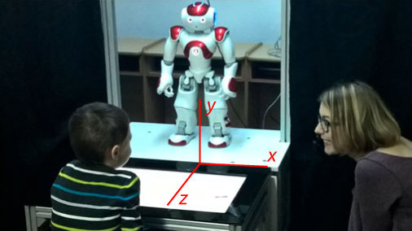
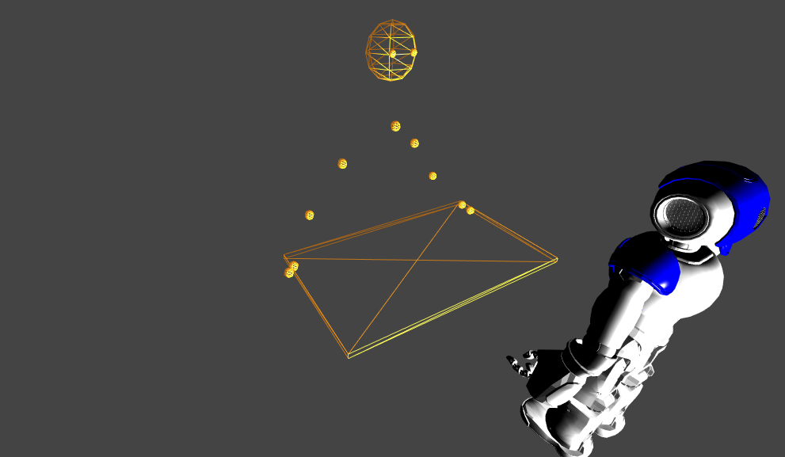

# DREAM Dataset


Within the European research project [DREAM: Development of Robot-Enhanced therapy for children with AutisM spectrum disorders](https://dream2020.github.io/DREAM/), a large evaluation of _Robot Assisted Therapy (RAT)_ has been conducted, compared to _Standard Human Treatment (SHT)_. Both conditions follows a _Applied Behaviour Analysis (ABA)_ protocol. 76 children diagnosed with _Autism Spectrum Disorders (ASD)_ participated, going through a total of almost 4000 therapy sessions and more than 360 hours of therapy. Each session was recorded with three RGB cameras and two RGBD (Kinect) cameras, providing detailed information of children's behaviour during therapy. 

This public release of the dataset does not include any fotage of children. Instead, processed features of the recorded data is provided. This data is produced using an integrated sensor system developed within DREAM. Please refer to [github.com/dream2020/sensors](https://github.com/dream2020/sensors) for more information.  

If you use this dataset in your own work, we kindly ask you for attribution to: 

_This is a pre-release of the complete dataset, comprising a single sample session file only. 
The complete dataset will be released along with an academic journal publication wich is currently under preparation. For more information, please contact [Erik Billing, University of Skövde](http://www.his.se/erikb/)._

The following primary features are included: 

* 10 joint 3D skeleton covering upper body, including head, shoulders, elbows, wrists, and hands,
* Head orientation
* Eye gaze 

An example of the therapy environment is presented below. In the RET condition, a [SoftBank Nao](https://www.softbankrobotics.com/emea/en/nao) is used as a stimulus for the child. A therapist is always sitting next to the child, supporting interaction during therapy.



All dataset features are specified in a common Cartesian frame of reference.

Additionally, the some metadata is included:

* Partisipant age,
* Participant gender,
* Participant numeric id,
* Initial ADOS score,
* Targeted ability/task,
* Therapy condition (RET or SHT),
* Date of therapy

## Specification and usage

All data in this dataset is stored in [JavaScript Object Notation (JSON)](https://www.json.org) format. The structure of the JSON dataset file is presented below, excluding numeric data here appearing as empty arrays _"[]"_. JSON data can be opened using standard libraries in most programming languages. Please refer to the [documentation](docs/DREAM-data.ipynb) for basic instructions on how to load and plot the data using [Python](https://www.python.org/) and [Jupyter](https://jupyter.org/).

```json
{
    "$id": "User 37_18_Intervention 2_20171102_123242.369000.json",
    "$schema": "https://raw.githubusercontent.com/dream2020/data/master/specification/dream.1.1.json",
    "ados": {
        "preTest": {
            "communication": 2,
            "interaction": 5,
            "module": 1.0,
            "play": 1,
            "protocol": "ADOS-G",
            "socialCommunicationQuestionnaire": 23,
            "stereotype": 0,
            "total": 7
        }
    },
    "condition": "RET",
    "date": "2017-11-02T12:32:42.369000",
    "eye_gaze": {"rx": [],"ry": [],"rz": []},
    "frame_rate": 25.1,
    "head_gaze": {"rx": [],"ry": [],"rz": []},
    "participant": {"ageInMonths": 47,"gender": "male","id": 37},
    "skeleton": {
        "elbow_left": {"confidence": [],"x": [],"y": [],"z": []},
        "elbow_right": {"confidence": [],"x": [],"y": [],"z": []},
        "hand_left": {"confidence": [],"x": [],"y": [],"z": []},
        "hand_right": {"confidence": [],"x": [],"y": [],"z": []},
        "head": {"confidence": [],"x": [],"y": [],"z": []},
        "sholder_center": {"confidence": [],"x": [],"y": [],"z": []},
        "sholder_left": {"confidence": [],"x": [],"y": [],"z": []},
        "sholder_right": {"confidence": [],"x": [],"y": [],"z": []},
        "wrist_left": {"confidence": [],"x": [],"y": [],"z": []},
        "wrist_right": {"confidence": [],"x": [],"y": [],"z": []}
    },
    "task": "TT"
}
```

This format is specified in detail as a JSON Schema, provided as part of this dataset: [dream.1.1.json](/specification/dream.1.1.json).

## Visualisation

The DREAM Dataset can be visualised using the [DREAM Data Visualizer](https://github.com/dream2020/DREAM-data-visualizer). A snapshot from the [example data](dataset/data_example.json) is presented below.



## Attribution

An academic journal publication that will be the primary reference to this work is currently under preparation. In the meantime, please refer to this work in the following way: 

_Erik A. Billing (2019) Open DREAM Dataset. DREAM: Development of Robot-Enhanced Therapy for Children with Autism Spectrum Disorders. EU-FP7 grant 611391. https://github.com/dream2020/data. https://doi.org/10.5281/zenodo.3571008._

[](https://zenodo.org/badge/latestdoi/179277477)

Please note that attribution is required by the licence, as stated below.

## License


This work is licensed under a [Creative Commons Attribution-NonCommercial-NoDerivatives 4.0 International License](https://creativecommons.org/licenses/by-nc-sa/4.0/). This licence permits
_copying and redistribution of the material in any medium or format_ and states that 
_the licensor cannot revoke these freedoms as long as you follow the license terms._ This freedom is given under the following terms:

* __Attribution__ - You must give appropriate credit, provide a link to the license, and indicate if changes were made. You may do so in any reasonable manner, but not in any way that suggests the licensor endorses you or your use.
* __NonCommercial__ - You may not use the material for commercial purposes.
* __ShareAlike__ - If you remix, transform, or build upon the material, you must distribute your contributions under the same license as the original.
* __No additional restrictions__ - You may not apply legal terms or technological measures that legally restrict others from doing anything the license permits.

### Notices
* You do not have to comply with the license for elements of the material in the public domain or where your use is permitted by an applicable exception or limitation.
* No warranties are given. The license may not give you all of the permissions necessary for your intended use. For example, other rights such as publicity, privacy, or moral rights may limit how you use the material.

## Acknowledgment

This work is part of the [DREAM project](https://dream2020.github.io/DREAM/) funded by the European Commission’s Seventh Framework Program (FP7), grant #611391.